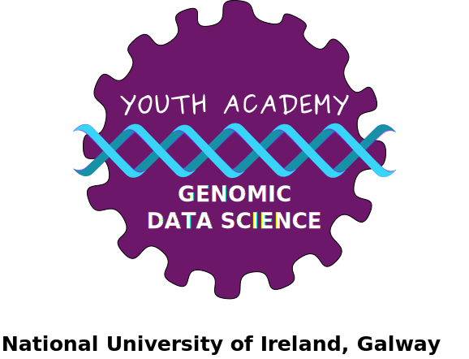

# Welcome to the course repo for **NUIG Youth Academy: Genomic Data Science!**

Please note that this project is released with a [Contributor Code of Conduct](CODE_OF_CONDUCT.md). By contributing to this project, you agree to abide by its terms.

The course material in this course is licensed [CC-BY-SA](https://creativecommons.org/licenses/by-sa/4.0/), meaning you are free to use it, change it, and remix it as long as you give appropriate credit and distribute any new materials under the same license.  The _code_ is [MIT](https://opensource.org/licenses/MIT)-licensed.

